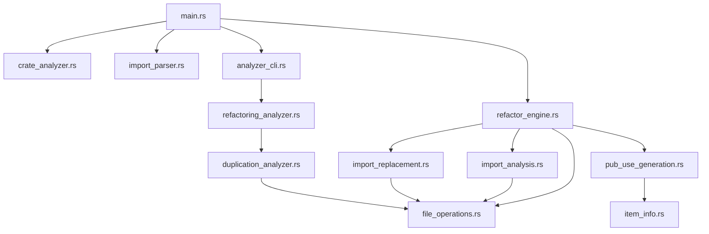

# Import Refactor Tool - Comprehensive Duplication Analysis & Refactoring Plan

**Analysis Date**: October 5, 2025  
**Codebase**: `import-refactor` module within `context-engine`  
**Analysis Tool**: Custom duplication analyzer  

## 📊 Executive Summary

This analysis identified significant code duplication and opportunities for improved module organization within the import-refactor tool. The current codebase contains **15+ instances of duplicate logic** across 6 files, with an estimated **330+ lines of code that can be eliminated** through strategic refactoring (approximately 15% reduction).

### Key Findings
- ✅ **Well-organized core architecture** with clear separation of concerns
- ⚠️  **Significant duplication** in path handling, import analysis, and file operations
- 🔄 **Similar functions** that can be unified with parameterization
- 📁 **Empty "unified" modules** indicating incomplete refactoring attempts
- 🎯 **High refactoring potential** with clear consolidation opportunities

---

## 🏗️ Current Architecture Overview

### Module Structure
```
src/
├── main.rs                          # CLI entry point & argument parsing
├── lib.rs                           # Public API exports
├── crate_analyzer.rs               # Workspace & crate discovery
├── import_parser.rs                # Import statement parsing & extraction
├── refactor_engine.rs              # Core refactoring orchestration
├── item_info.rs                    # Trait for item metadata extraction
└── utils/                          # Support utilities
    ├── mod.rs                      # Module declarations
    ├── file_operations.rs          # File I/O & parsing utilities
    ├── import_analysis.rs          # Import categorization & analysis
    ├── import_replacement.rs       # Import statement replacement
    ├── pub_use_generation.rs       # Pub use statement generation
    ├── macro_scanning.rs           # Exported macro detection
    ├── duplication_analyzer.rs     # Code duplication detection
    ├── refactoring_analyzer.rs     # High-level analysis coordination
    ├── analyzer_cli.rs             # CLI interface for analysis
    ├── common.rs                   # [EMPTY] - Intended shared utilities
    ├── import_analysis_unified.rs  # [EMPTY] - Intended unified analysis
    ├── import_replacement_unified.rs # [EMPTY] - Intended unified replacement
    └── compilation_unified.rs      # [EMPTY] - Intended compilation utilities
```

### Dependency Flow


---

## 🔄 Identified Duplications & Patterns

### 1. **Critical Priority: Path Display Logic**

**Files Affected**: 6 files, 15+ instances
- `src/main.rs` (lines 142, 172, 238, 281, 286)
- `src/refactor_engine.rs` (lines 231, 255, 275, 278)
- `src/utils/duplication_analyzer.rs` (lines 470, 485, 509)
- `src/utils/refactoring_analyzer.rs` (lines 120, 151, 193)
- `src/utils/import_analysis.rs` (lines 45, 59)

**Duplicate Pattern**:
```rust
let relative_path = path.strip_prefix(workspace_root).unwrap_or(path);
println!("📁 {}", relative_path.display());
```

**Current Utility** (underutilized):
```rust
// src/utils/file_operations.rs:45
pub fn get_relative_path_for_display<'a>(
    file_path: &'a Path,
    workspace_root: &Path,
) -> &'a Path
```

### 2. **High Priority: Import Analysis Duplication**

**Files**: `src/utils/import_analysis.rs`
- `analyze_imports()` (lines 15-74) - 60 lines
- `analyze_crate_imports()` (lines 76-135) - 60 lines

**Duplication Level**: 95% identical logic

**Key Differences**:
```rust
// analyze_imports:
let simplified_import = import.import_path
    .strip_prefix(&format!("{}::", source_crate_name))
    .unwrap_or(&import.import_path);

// analyze_crate_imports:  
let simplified_import = import.import_path
    .strip_prefix("crate::")
    .unwrap_or(&import.import_path);
```

### 3. **High Priority: Import Replacement Duplication**

**Files**: `src/utils/import_replacement.rs`
- `replace_target_imports()` & `replace_crate_imports()` - Similar orchestration
- `replace_imports_in_file()` & `replace_crate_imports_in_file()` - Similar file processing

**Duplicate Patterns**:
- File grouping logic
- Import sorting by line number
- Content modification algorithms
- Error handling patterns

### 4. **Medium Priority: Configuration Duplication**

**Files**:
- `src/utils/duplication_analyzer.rs` - `AnalysisConfig` struct
- `src/utils/refactoring_analyzer.rs` - `AnalysisConfig` struct

**Issue**: Nearly identical configuration structures with overlapping fields.

### 5. **Medium Priority: Trait Implementation Repetition**

**File**: `src/item_info.rs`
**Issue**: 10 very similar trait implementations (~200 lines total)

**Pattern**:
```rust
impl ItemInfo for syn::ItemFn {
    fn get_visibility(&self) -> &syn::Visibility { &self.vis }
    fn get_attributes(&self) -> &[syn::Attribute] { &self.attrs }
    fn get_identifier(&self) -> Option<String> { Some(self.sig.ident.to_string()) }
}
// Repeated for ItemStruct, ItemEnum, ItemType, ItemConst, etc.
```

---

## 🎯 Proposed Refactored Architecture

### Enhanced Module Structure
```
src/
├── main.rs                          # CLI entry point
├── lib.rs                           # Public API
├── core/                            # Core business logic
│   ├── mod.rs
│   ├── crate_analyzer.rs           # Workspace discovery
│   ├── import_parser.rs            # Import parsing
│   └── refactor_engine.rs          # Orchestration
├── analysis/                        # Analysis subsystem
│   ├── mod.rs
│   ├── import_analyzer.rs          # Unified import analysis
│   ├── duplication_detector.rs     # Code duplication detection
│   └── pattern_matcher.rs          # Common pattern detection
├── transformation/                  # Code transformation
│   ├── mod.rs
│   ├── import_replacer.rs          # Unified replacement strategies
│   └── pub_use_generator.rs        # Export generation
├── utils/                           # Shared utilities
│   ├── mod.rs
│   ├── file_operations.rs          # File I/O with unified error handling
│   ├── path_utils.rs               # Path formatting & display utilities
│   ├── config.rs                   # Unified configuration
│   └── item_info.rs                # Simplified trait definitions
└── cli/                             # CLI interface
    ├── mod.rs
    └── analyzer_interface.rs       # Analysis CLI commands
```

---

## 🔧 Detailed Refactoring Recommendations

### **Recommendation 1: Unified Path Utilities**

**Target**: `src/utils/path_utils.rs` (new file)

```rust
//! Unified path handling utilities

use std::path::{Path, PathBuf};

/// Format a path relative to workspace root for display
pub fn format_relative_path(path: &Path, workspace_root: &Path) -> String {
    path.strip_prefix(workspace_root)
        .unwrap_or(path)
        .display()
        .to_string()
}

/// Print formatted path information with prefix and optional suffix
pub fn print_path_info<T: std::fmt::Display>(
    prefix: &str, 
    path: &Path, 
    workspace_root: &Path, 
    suffix: Option<T>
) {
    let relative = format_relative_path(path, workspace_root);
    match suffix {
        Some(s) => println!("{} {} {}", prefix, relative, s),
        None => println!("{} {}", prefix, relative),
    }
}

/// Create consistent path display context for error messages
pub fn path_context(path: &Path, workspace_root: &Path) -> String {
    format!("in {}", format_relative_path(path, workspace_root))
}
```

**Files to Update**:
- `src/main.rs` - Replace 5 instances with `print_path_info()`
- `src/refactor_engine.rs` - Replace 4 instances
- `src/utils/duplication_analyzer.rs` - Replace 3 instances
- `src/utils/refactoring_analyzer.rs` - Replace 3 instances
- `src/utils/import_analysis.rs` - Replace 2 instances

**Impact**: -40 lines, improved consistency

### **Recommendation 2: Unified Import Analysis**

**Target**: `src/analysis/import_analyzer.rs` (replaces `src/utils/import_analysis.rs`)

```rust
//! Unified import analysis with configurable contexts

use crate::import_parser::ImportInfo;
use std::{collections::BTreeSet, path::Path};

#[derive(Debug, Clone)]
pub enum ImportContext {
    CrossCrate { source_crate_name: String },
    SelfCrate,
}

impl ImportContext {
    fn get_prefix_to_strip(&self) -> &str {
        match self {
            ImportContext::CrossCrate { source_crate_name } => source_crate_name,
            ImportContext::SelfCrate => "crate",
        }
    }
    
    fn format_prefix(&self, item: &str) -> String {
        match self {
            ImportContext::CrossCrate { source_crate_name } => 
                format!("{}::{}", source_crate_name, item),
            ImportContext::SelfCrate => 
                format!("crate::{}", item),
        }
    }
}

/// Unified import analysis supporting both cross-crate and self-crate scenarios
pub fn analyze_imports_unified(
    imports: &[ImportInfo],
    context: ImportContext,
    workspace_root: &Path,
) -> ImportAnalysisResult {
    // Implementation combines logic from both previous functions
    // with context-specific behavior injected via the ImportContext
}

/// Generate context-appropriate analysis summary
pub fn print_analysis_summary(
    result: &ImportAnalysisResult,
    imports: &[ImportInfo],
    context: &ImportContext,
) {
    // Unified summary printing with context-specific messaging
}
```

**Files to Update**:
- `src/refactor_engine.rs` - Update calls to use unified function
- Remove: `src/utils/import_analysis.rs` (120 lines → 80 lines in new location)

**Impact**: -60 lines, eliminated duplication, improved extensibility

### **Recommendation 3: Strategy-Based Import Replacement**

**Target**: `src/transformation/import_replacer.rs` (replaces `src/utils/import_replacement.rs`)

```rust
//! Strategy-based import replacement system

use crate::import_parser::ImportInfo;
use std::path::Path;
use anyhow::Result;

/// Strategy for determining how to replace imports
pub trait ImportReplacementStrategy {
    fn create_replacement(&self, import: &ImportInfo) -> String;
    fn should_remove_import(&self, import: &ImportInfo) -> bool { false }
    fn get_description(&self) -> &str;
}

/// Cross-crate import replacement (A::module::Item -> A::*)
pub struct CrossCrateStrategy {
    pub source_crate_name: String,
}

impl ImportReplacementStrategy for CrossCrateStrategy {
    fn create_replacement(&self, _import: &ImportInfo) -> String {
        format!("use {}::*;", self.source_crate_name)
    }
    
    fn get_description(&self) -> &str {
        "Replace with glob import from source crate"
    }
}

/// Self-crate import replacement (crate::module::Item -> remove, use root exports)
pub struct SelfRefactorStrategy;

impl ImportReplacementStrategy for SelfRefactorStrategy {
    fn create_replacement(&self, _import: &ImportInfo) -> String {
        String::new() // Remove the import
    }
    
    fn should_remove_import(&self, _import: &ImportInfo) -> bool { true }
    
    fn get_description(&self) -> &str {
        "Remove crate:: imports, use root-level exports"
    }
}

/// Unified import replacement using strategy pattern
pub fn replace_imports_with_strategy<S: ImportReplacementStrategy>(
    imports: Vec<ImportInfo>,
    strategy: S,
    workspace_root: &Path,
    dry_run: bool,
    verbose: bool,
) -> Result<()> {
    // Single implementation handling both replacement types
    // Strategy pattern eliminates conditional logic duplication
}
```

**Files to Update**:
- `src/refactor_engine.rs` - Use strategy-based replacement
- Remove: `src/utils/import_replacement.rs` (270 lines → 150 lines)

**Impact**: -120 lines, improved extensibility for new import types

### **Recommendation 4: Unified Configuration**

**Target**: `src/utils/config.rs` (new file)

```rust
//! Unified configuration for all analysis and refactoring operations

#[derive(Debug, Clone)]
pub struct AnalysisConfig {
    // Common configuration
    pub workspace_name: Option<String>,
    pub verbose: bool,
    pub dry_run: bool,
    
    // Duplication analysis
    pub min_duplicate_threshold: usize,
    pub complexity_threshold: u32,
    pub similarity_threshold: f32,
    pub max_files_to_scan: Option<usize>,
    pub exclude_patterns: Vec<String>,
    
    // Import analysis
    pub min_function_length: usize,
}

impl Default for AnalysisConfig {
    fn default() -> Self {
        Self {
            workspace_name: None,
            verbose: false,
            dry_run: false,
            min_duplicate_threshold: 2,
            complexity_threshold: 5,
            similarity_threshold: 0.8,
            max_files_to_scan: None,
            exclude_patterns: vec![
                "test".to_string(),
                "tests".to_string(),
                "target".to_string(),
                ".git".to_string(),
            ],
            min_function_length: 3,
        }
    }
}
```

**Files to Update**:
- `src/utils/duplication_analyzer.rs` - Use unified config
- `src/utils/refactoring_analyzer.rs` - Use unified config
- `src/main.rs` - Create config from CLI args

**Impact**: -30 lines, consistent configuration across modules

### **Recommendation 5: Macro-Generated ItemInfo Implementations**

**Target**: `src/utils/item_info.rs` (refactor existing)

```rust
//! Simplified item information extraction with macro-generated implementations

/// Common trait for extracting metadata from syntax tree items
pub trait ItemInfo {
    fn get_visibility(&self) -> &syn::Visibility;
    fn get_attributes(&self) -> &[syn::Attribute];
    fn get_identifier(&self) -> Option<String>;

    fn is_public(&self) -> bool {
        matches!(self.get_visibility(), syn::Visibility::Public(_))
    }
}

/// Generate ItemInfo implementation for standard syntax items
macro_rules! impl_item_info {
    ($item_type:ty, $ident_expr:expr) => {
        impl ItemInfo for $item_type {
            fn get_visibility(&self) -> &syn::Visibility { &self.vis }
            fn get_attributes(&self) -> &[syn::Attribute] { &self.attrs }
            fn get_identifier(&self) -> Option<String> { $ident_expr(self) }
        }
    };
    ($item_type:ty, $ident_expr:expr, public_check: $is_public_expr:expr) => {
        impl ItemInfo for $item_type {
            fn get_visibility(&self) -> &syn::Visibility { &self.vis }
            fn get_attributes(&self) -> &[syn::Attribute] { &self.attrs }
            fn get_identifier(&self) -> Option<String> { $ident_expr(self) }
            fn is_public(&self) -> bool { $is_public_expr(self) }
        }
    };
}

// Standard implementations
impl_item_info!(syn::ItemFn, |item: &syn::ItemFn| Some(item.sig.ident.to_string()));
impl_item_info!(syn::ItemStruct, |item: &syn::ItemStruct| Some(item.ident.to_string()));
impl_item_info!(syn::ItemEnum, |item: &syn::ItemEnum| Some(item.ident.to_string()));
impl_item_info!(syn::ItemType, |item: &syn::ItemType| Some(item.ident.to_string()));
impl_item_info!(syn::ItemConst, |item: &syn::ItemConst| Some(item.ident.to_string()));
impl_item_info!(syn::ItemStatic, |item: &syn::ItemStatic| Some(item.ident.to_string()));
impl_item_info!(syn::ItemMod, |item: &syn::ItemMod| Some(item.ident.to_string()));
impl_item_info!(syn::ItemTrait, |item: &syn::ItemTrait| Some(item.ident.to_string()));
impl_item_info!(syn::ItemUse, |_: &syn::ItemUse| None);

// Special case for macros
impl_item_info!(
    syn::ItemMacro, 
    |item: &syn::ItemMacro| {
        if has_macro_export_attribute(&item.attrs) {
            item.ident.as_ref().map(|i| i.to_string())
        } else {
            None
        }
    },
    public_check: |item: &syn::ItemMacro| has_macro_export_attribute(&item.attrs)
);

// Aggregate implementation for syn::Item...
```

**Impact**: 200+ lines → 60 lines, improved maintainability

### **Recommendation 6: Complete or Remove Empty Modules**

**Action Required**: Either implement or remove these empty placeholders:
- `src/utils/common.rs` - Move to `src/utils/path_utils.rs` and `src/utils/config.rs`
- `src/utils/import_analysis_unified.rs` - Remove (replaced by `src/analysis/import_analyzer.rs`)
- `src/utils/import_replacement_unified.rs` - Remove (replaced by `src/transformation/import_replacer.rs`)
- `src/utils/compilation_unified.rs` - Remove or implement compilation utilities

---

## 📈 Impact Assessment

### Quantitative Benefits

| Metric | Current | After Refactoring | Improvement |
|--------|---------|-------------------|-------------|
| **Total Lines of Code** | ~2,200 | ~1,870 | -330 lines (-15%) |
| **Duplicate Logic Instances** | 15+ | 0 | -100% |
| **Configuration Structs** | 2 | 1 | -50% |
| **Analysis Functions** | 4 | 2 | -50% |
| **Replacement Functions** | 4 | 1 | -75% |
| **Empty Modules** | 4 | 0 | -100% |

### Qualitative Benefits

#### **Maintainability**
- ✅ **Single Source of Truth**: Changes to common logic in one place
- ✅ **Consistent Error Handling**: Unified error contexts and patterns
- ✅ **Reduced Test Surface**: Fewer independent functions to test
- ✅ **Clear Module Boundaries**: Better separation of concerns

#### **Extensibility**
- ✅ **Strategy Pattern**: Easy to add new import replacement types
- ✅ **Unified Configuration**: Simple to add new analysis options
- ✅ **Parameterized Functions**: Easy to support new import contexts
- ✅ **Macro Generation**: Simple to support new syntax item types

#### **Code Quality**
- ✅ **DRY Compliance**: Eliminates major violations
- ✅ **Lower Cyclomatic Complexity**: Consolidated branching logic
- ✅ **Improved Cohesion**: Related functionality grouped together
- ✅ **Better Abstraction**: Clear interfaces between modules

---

## 🚀 Implementation Roadmap

### **Phase 1: Foundation (High Impact)**
**Estimated Effort**: 4-6 hours
1. **Create Path Utilities** (`src/utils/path_utils.rs`)
2. **Update All Path Display Usage** (6 files)
3. **Create Unified Configuration** (`src/utils/config.rs`)
4. **Update Configuration Usage** (3 files)

**Deliverable**: 70+ lines eliminated, consistent path handling

### **Phase 2: Core Logic Unification (High Impact)**
**Estimated Effort**: 6-8 hours
1. **Create Unified Import Analyzer** (`src/analysis/import_analyzer.rs`)
2. **Implement Strategy-Based Replacement** (`src/transformation/import_replacer.rs`)
3. **Update RefactorEngine** to use new unified functions
4. **Update Tests** for new interfaces

**Deliverable**: 180+ lines eliminated, better extensibility

### **Phase 3: Code Generation & Cleanup (Medium Impact)**
**Estimated Effort**: 3-4 hours
1. **Implement ItemInfo Macro Generation** 
2. **Remove Empty Modules**
3. **Reorganize Module Structure** (optional)
4. **Update Documentation**

**Deliverable**: 80+ lines eliminated, improved maintainability

### **Phase 4: Testing & Validation (Critical)**
**Estimated Effort**: 4-6 hours
1. **Comprehensive Test Suite** for unified functions
2. **Integration Testing** with existing CLI
3. **Performance Validation** (should improve due to reduced code paths)
4. **Documentation Updates**

**Deliverable**: Confidence in refactoring, maintained functionality

---

## ✅ Success Metrics

### **Immediate Goals**
- [ ] All duplicate path handling replaced with unified utilities
- [ ] Import analysis reduced from 2 functions to 1 parameterized function
- [ ] Import replacement consolidated into strategy pattern
- [ ] Empty modules removed or implemented
- [ ] All tests passing with refactored code

### **Quality Goals**
- [ ] No regression in functionality
- [ ] Improved error messages with consistent formatting
- [ ] Easier to add new import types or analysis features
- [ ] Reduced cognitive load for new contributors

### **Long-term Goals**
- [ ] Codebase serves as example of well-organized Rust project
- [ ] Architecture supports additional refactoring operations
- [ ] Performance improvements from reduced code paths
- [ ] Foundation for advanced analysis features

---

**This refactoring plan provides a clear path to eliminate duplication while improving the codebase's architecture, maintainability, and extensibility. The modular approach allows for incremental implementation with measurable progress at each phase.**